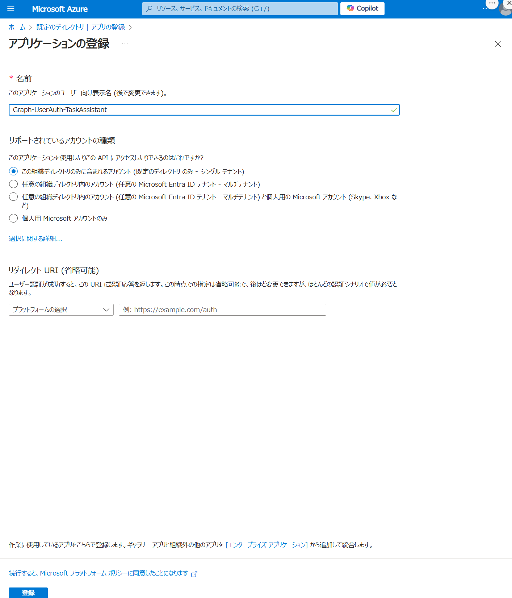

## CosmosDB

### 払い出し


### Vector機能の有効化


### データベースとコンテナ
vectorフィールドを設定。embedding-largeモデルを使う。


# Outlook API
https://learn.microsoft.com/ja-jp/graph/tutorials/python?context=outlook%2Fcontext&tabs=aad




アプリケーション (クライアント) ID の値をコピー
ディレクトリ (テナント) ID もコピー
- 298002b6-64ce-4554-adcd-412b2eefcb7f
- e4ed36be-38d0-4ddd-9c85-0962719b3135


[ パブリック クライアント フローを許可する] トグルを [はい] に変更


注意事項
- アプリの登録に対して Microsoft Graph のアクセス許可を構成していないことに注意してください。 これは、サンプルで 動的同意 を使用して、ユーザー認証の特定のアクセス許可を要求するためです。

## クライアントシークレット


シークレットの値をコピー


## アクセス権

「アプリケーション許可」のアクセス権を付与


管理者の同意が必要


「エンタープライズアプリケーション」のリンクから同意


## アプリ
requirements.txtに設定
```bash
azure-identity
msgraph-sdk
```

pip install -r requirements.txt