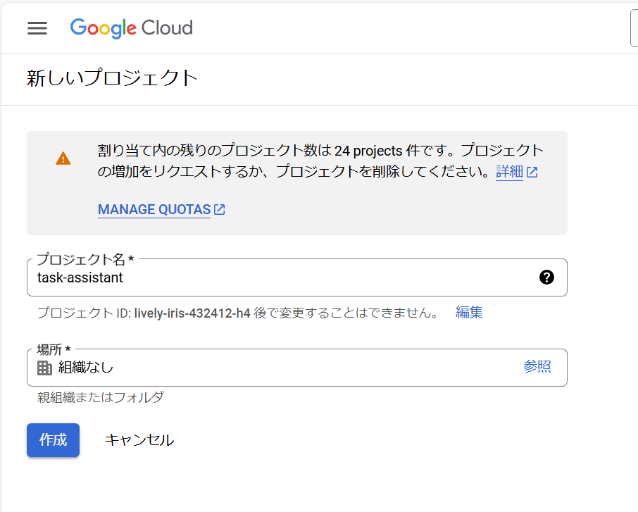
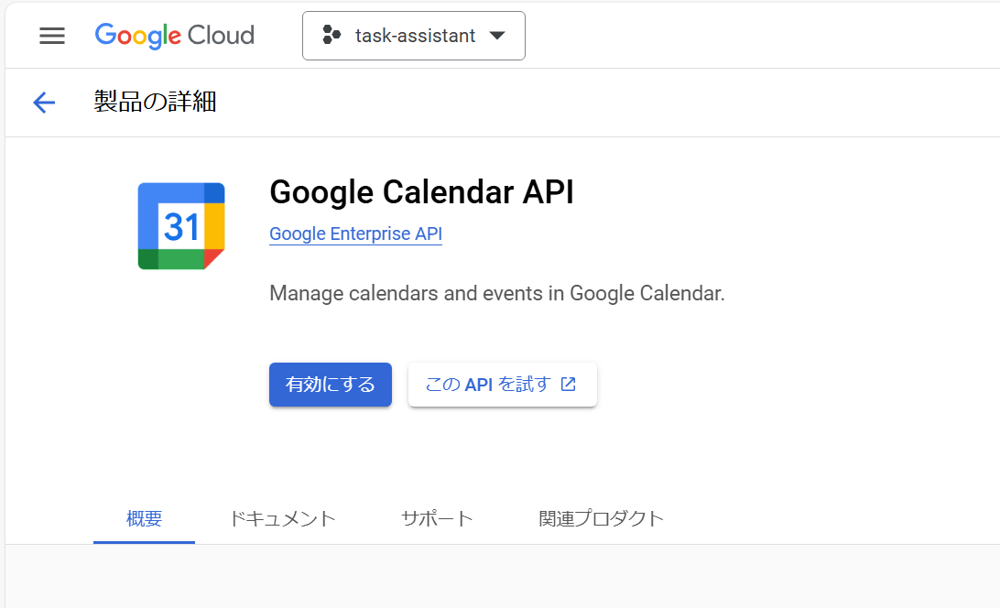
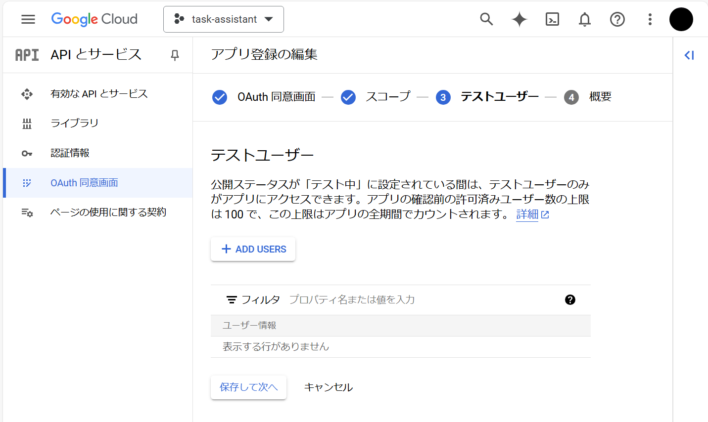
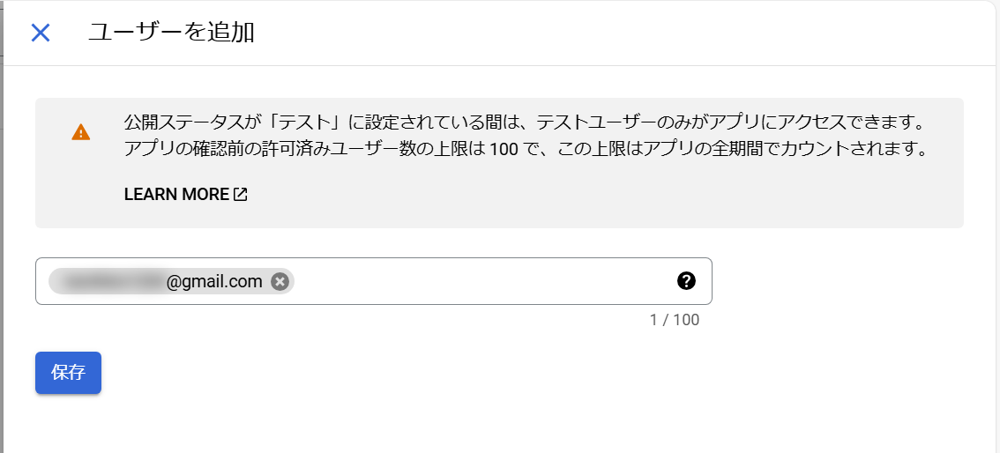

# Google Calendar API
https://developers.google.com/calendar/api/quickstart/python?hl=ja

## プロジェクト作成

## Google Calendar API有効化

## OAuth認証同意画面の構成

アプリ登録

スコープは設定せずに
テストユーザもそのまま

作成完

## 認証設定

Jsonをダウンロード

ダウンロードした JSON ファイルを credentials.json として保存

## テストユーザ作成

## 実行
F5で実行

続行

続行

Completeとなるので、VSCodeに戻る

GoogleCalendarに登録しているイベント10件が取得できた。
